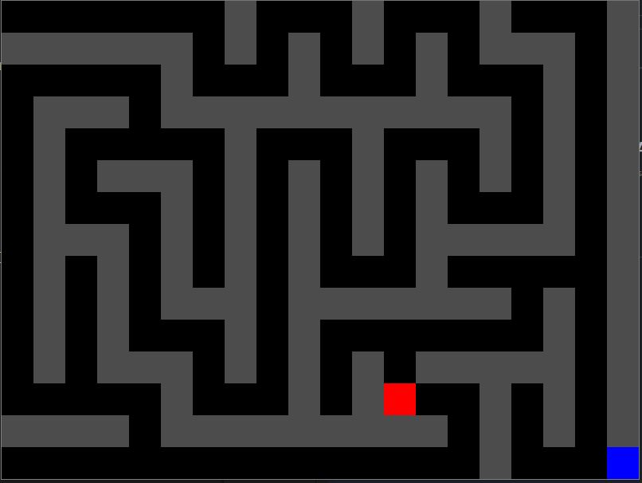

# Maze Game

This is a simple maze game built with LOVE2D. The game generates a random maze that is always solvable, and the player must navigate from the start position to the goal.

## How to Play

- Use the arrow keys (`Up`, `Down`, `Left`, `Right`) to move the player through the maze.
- The goal is to reach the blue square (bottom-right corner).
- When you reach the goal, a "You Win!" message will appear on the screen.

## How to run
- Make sure that you have Love2D installed
- download the repo files
- open the main.lua file with a code editor
- run the main.lua file in the code editor

